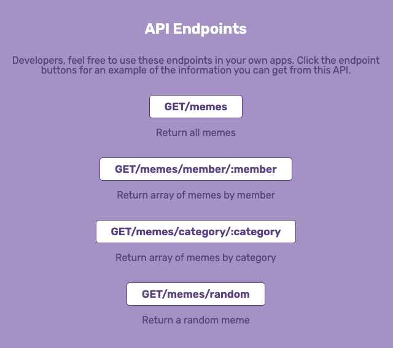
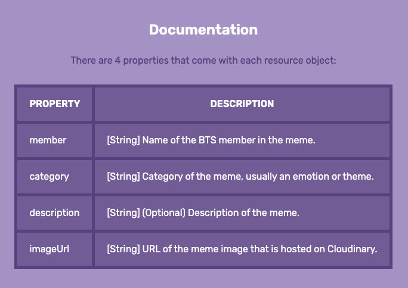

# BTS Memes API

## About
A RESTful API that uses HTTP requests to create, delete, and read bts meme images from a MongoDB database.
[Click here](https://bts-memes-api.herokuapp.com/) to view the public site.

### GET Endpoint (Public)
- This request returns memes from the MongoDB database. 
- The public site shows an example of how the memes can be filtered by member and category:

- The following GET requests can be made:

- Each resource object will come with:

### POST (not public): This request creates a new meme to store in MongoDB. In the example, a new meme is created with a form.
### DELETE (not public): This request deletes a meme from MongoDB. In the example, a meme is deleted with a button.

## How It's Made
**Tech used:** HTML, CSS, JavaScript, Node.js, Express, MongoDB, Cloudinary, Heroku

## Lessons Learned
- **Using MongoDB and Cloudinary** Instead of storing the images in the MongoDB database, I opted to store the image URL instead. When a POST request is made, the image is first uploaded via [Cloudinary](https://cloudinary.com/documentation/upload_images). The Cloudinary URL is then passed into the MongoDB database, along with any other meme details from the form. When a DELETE request is made, the image is deleted from Cloudinary. The meme information is also deleted from MongoDB. 